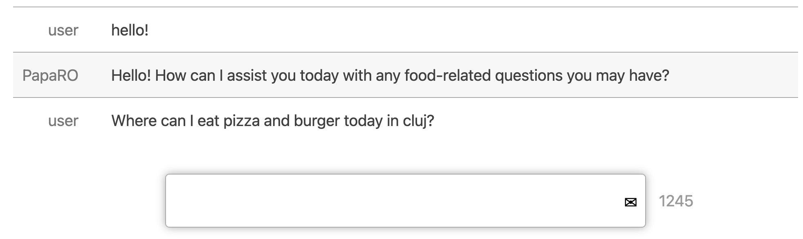

# Cuisine Recommandation API

A simple two-file JS-based UI for interacting with PapaRO's Cuisine Recommandation API in your browser. Requires you to supply your own API key.

Add you ChatGPT API key in OPENAI_KEY.txt in the root folder

